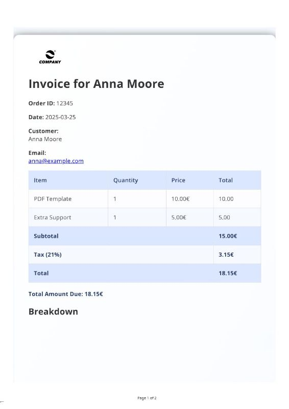
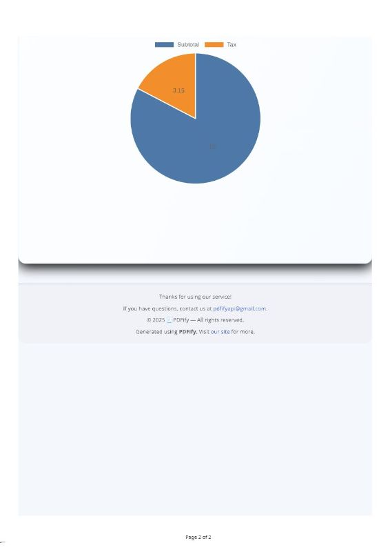
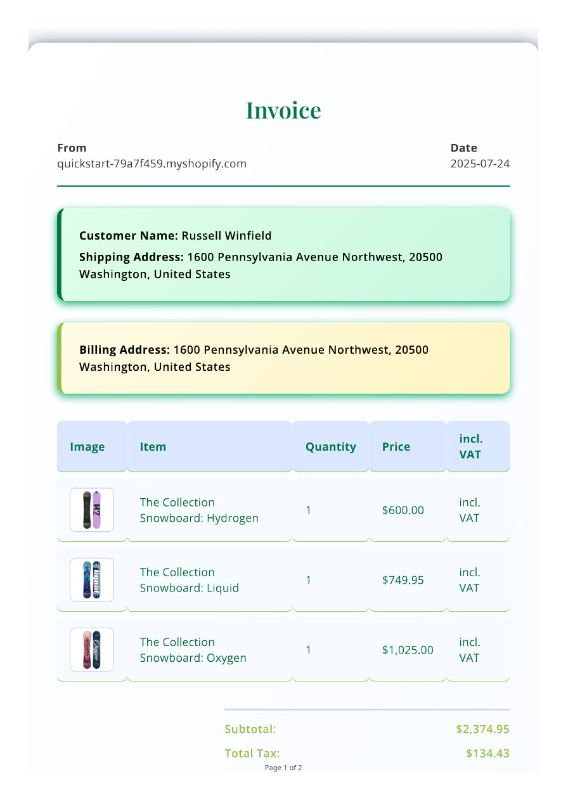

# 🧾 PDFify – Real-Time Branded PDF Generation for Modern E-Commerce & APIs

**PDFify** is a modern PDF generation service and backend engine that transforms structured data (JSON or HTML) into beautifully branded, standards-compliant PDF documents — including receipts, invoices, packing slips, confirmations, reports, and more.

It’s designed to support both developers and non-technical users with flexible API access, Shopify webhook integration, and premium pre-built templates. Built for performance, compliance, and modern business use cases — PDFify powers document automation across e-commerce and SaaS environments.

---

## 🚀 What It Does

- 📎 Accepts **JSON or HTML input** via REST API
- 🖨️ Returns **styled, production-ready PDFs** on the fly
- 🛒 Integrated with **Shopify** (via webhooks, no app install required)
- 🎨 Offers **branded templates** with product images, logos, and tax info
- 🔐 Compliant with **PDF/A-3b** and **ZUGFeRD** for German B2B workflows
- 🧑‍💻 Built for devs, but includes **Friendly Mode** UI for non-coders

---

🔍 Key Features

📦 Shopify Integration

Handles Shopify webhooks and order data

Converts real-time order info into branded PDF documents

Custom mapping between Shopify products and PDF content

🧾 Modular PDF Templates with Dual Rendering Modes

Two rendering modes: Developer Mode (advanced raw control) and Friendly Mode (user-friendly with default layouts)

Document types supported: Invoice, Receipt, Packing Slip, Shop Order, Therapy Report, and Raw HTML

Each template is dynamically rendered with real-time data input

Features:

Per-item tax rates, discounts, totals, VAT breakdowns

Multilingual formatting and customizable currency labels

Injected metadata, dynamic product/customer info, and branding

ZUGFeRD 2.1.1 XML embedding for German B2B and tax authority compliance

🎨 Dynamic HTML → PDF Conversion

Uses Puppeteer to render modular HTML templates into PDF

Templates are clean, responsive, and optimized for A4

Custom layouts per document type (invoices, receipts, tax forms, etc.)

📊 Usage Tracking & Access Control

Premium/pro-only features via usage metering

Enforced per-user limits for document generation

Logs for each document created, with metadata stored

📁 PDF/A Compliance & Metadata

ICC Profile embedding

XMP metadata for archival (including sanitization pipeline)

Validated using Ghostscript and VeraPDF

Standards-compliant output for long-term archiving and tax authority compatibility
---

## 🧰 Tech Stack

#### Backend & Frameworks
- **Node.js** + **Express** – Core backend service
- **Mongoose** – MongoDB ODM for managing document schemas
- **express-session** + **connect-mongo** – Session handling and storage

#### PDF Generation & Compliance
- **pdf-lib** – Low-level PDF editing and embedding (used for metadata, ZUGFeRD, ICC, etc.)
- **Puppeteer** – Headless Chrome for rendering HTML invoices into PDFs
- **Ghostscript** (external) – PDF/A-3b compliance validation
- **Java CLI for ZUGFeRD** – Java-based ZUGFeRD XML embedder (`ZUGFeRDEmbedder`)

#### Email & Payment
- **nodemailer** – Email service (e.g., delivery confirmations)
- **stripe** – Payment processing and pro/premium feature gating

#### Data Handling
- **dotenv** – Environment config
- **body-parser**, **cors** – API input handling
- **axios** – HTTP requests (Shopify or external API calls)
- **date-fns** – Date formatting utilities

#### Security & Auth
- **jsonwebtoken** – Token-based authentication
- **bcrypt**, **bcryptjs** – Password hashing

#### Other Utilities
- **archiver** – ZIP archive creation for multi-doc exports
- **node-cron** – Background tasks (e.g., cleanup, scheduled validations)
- **diff** – Used in metadata comparison or version control
- **xmlbuilder2**, **xmldom** – XML generation and parsing (ZUGFeRD)
- **web-streams-polyfill** – PDF stream compatibility

#### Dev Tools
- **nodemon** – Live dev server reloads

---

## 🚧 Source Code

This repository is for **public showcase purposes only**.  

If you're interested in a demo, technical deep-dive, or collaboration, feel free to reach out.

---

## 🔗 Demo / Preview

Video demo coming soon.
---

## 📸 Screenshots

### 🧾 Invoice Rendering (Development View)

---

### 🛒 Shopify → PDF Generation

---

### 📦 PDFify Architecture / Branding

---

© Lidija Jokić – Built with care, for modern document automation
