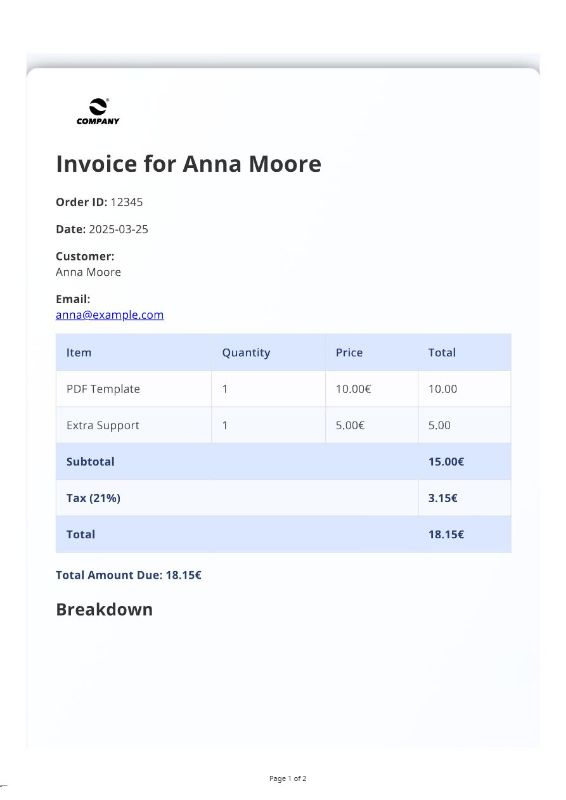
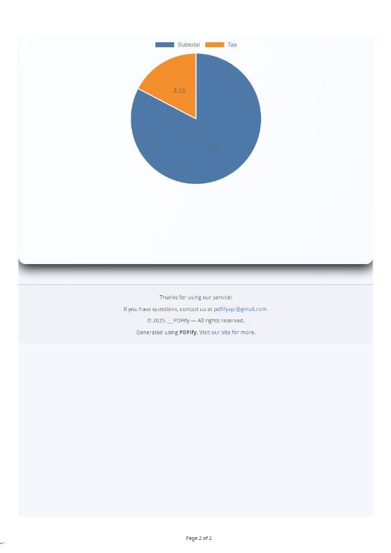
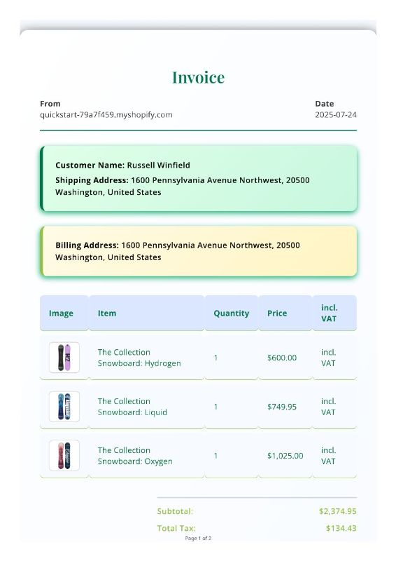

PDFify

PDFify is a modern PDF generation service and backend engine that transforms structured data (JSON or HTML) into beautifully branded, standards-compliant PDF documents — including receipts, invoices, packing slips, confirmations, reports, and more.

It supports both developers and non-technical users with flexible API access, Shopify and WooCommerce integrations, and premium pre-built templates. Built for performance, compliance, and modern e-commerce use cases — PDFify powers customer-facing invoices and merchant-facing tax-compliant documents.

🚀 What It Does

📎 Accepts JSON, HTML, or CSV input via REST API

🖨️ Returns styled, production-ready PDFs on the fly

🛒 Integrated with Shopify & WooCommerce (via webhooks and APIs, no plugin/app install required)

🎨 Offers styled customer invoices with branding, product images, and multilingual formatting

🔐 Generates compliant merchant PDFs (PDF/A-3b + ZUGFeRD XML) for B2B and tax authority workflows

🧑‍💻 Built for devs, but includes Friendly Mode UI for non-coders

🔍 Key Features
🧾 Customer-Facing Documents

Branded, styled invoices and receipts (logos, product images, custom colors, fonts)

Multilingual formatting and localized currency display

Per-item tax numbers, VAT breakdowns, discounts, totals

Responsive layouts optimized for A4 and mobile viewing

📁 Merchant-Facing Compliance

PDF/A-3b archival compliance with Ghostscript validation

ZUGFeRD 2.1.1 XML embedding handled natively via Node.js (pdf-lib + XML builders)

ICC output intent profiles for color compliance

XMP metadata embedding + sanitization pipeline

VeraPDF-ready local copies for long-term archival and tax authority compatibility

📦 Shopify & WooCommerce Integration

Processes real-time order data from Shopify (webhooks) and WooCommerce (REST API)

Converts live store events into both customer-facing invoices and merchant-facing compliant PDFs

Bulk ZIP export of invoices/receipts for batch order processing

Date range selection to generate PDFs for a specific sales period

Flexible product-to-PDF content mapping

Multi-shop support with per-store usage tracking

🧑‍💻 Developer Mode Enhancements

Accepts CSV input for structured bulk document generation

Raw HTML injection for complete template control

Logs and metadata inspection tools for debugging

Ideal for SaaS integrations, testing, and automation pipelines

🎨 Modular Templates & Dual Rendering Modes

Developer Mode: granular control over layouts and raw HTML/CSV input

Friendly Mode: pre-built templates for invoices, receipts, packing slips, shop orders, therapy reports, or custom docs

Modular HTML template engine, rendered to PDF via Puppeteer

📊 Usage Tracking & Access Control

Premium/pro-only features with per-user and per-store metering

Document logs with metadata storage

Access control for multi-tenant e-commerce setups

🧰 Tech Stack

Backend & Frameworks

Node.js + Express — Core backend

Mongoose (MongoDB ODM)

express-session + connect-mongo — Session handling

PDF Generation & Compliance

Puppeteer — HTML → PDF rendering

pdf-lib — Low-level PDF editing (metadata, ICC, ZUGFeRD XML embedding)

Ghostscript — PDF/A-3b compliance validation

VeraPDF — Standards verification

E-commerce Integrations

Shopify Webhooks API

WooCommerce REST API

Bulk & Export Tools

CSV parsing for Developer Mode

archiver — Multi-document ZIP exports

Date-range filtering for batch generation

Payments & Email

Stripe — Payments & feature gating

nodemailer — Email delivery

Security

JWT — Token-based authentication

bcrypt/bcryptjs — Password hashing

Other Utilities

node-cron — Background cleanup/validations

xmlbuilder2, xmldom — XML generation/parsing

diff — Metadata comparison

web-streams-polyfill — PDF stream compatibility

---

## 🚧 Source Code

This repository is for **public showcase purposes only**.  

If you're interested in a demo, technical deep-dive, or collaboration, feel free to reach out.

---

## 🔗 Demo / Preview

Video demo coming soon.

---

## 📸 Screenshots

### 🧾 Invoice Rendering (Development Mode)

---

### 🛒 Shopify → PDF Generation

---

### 📦 PDFify Architecture / Branding

---

© Lidija Jokić – Built with care, for modern document automation
